io-bound
Синхронный код

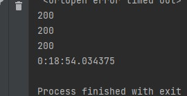

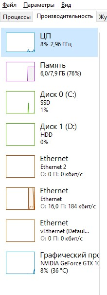

12 воркеров

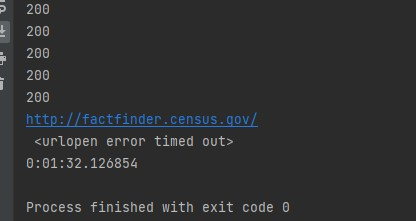

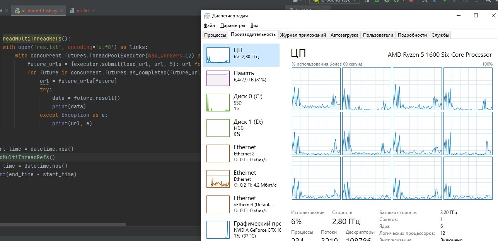

5 воркеров

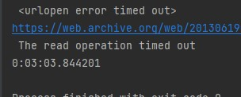

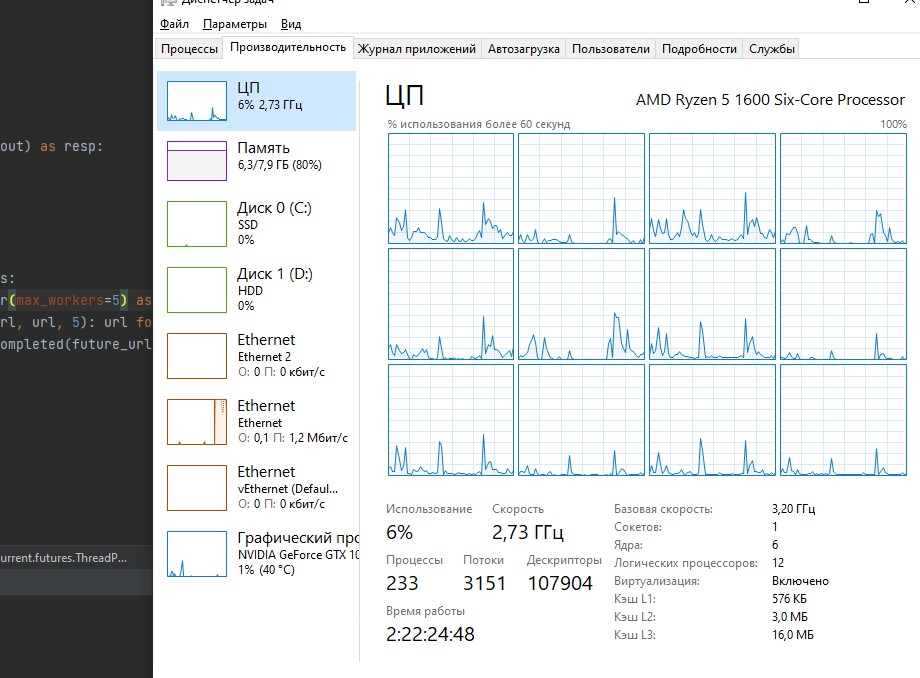

100 воркеров

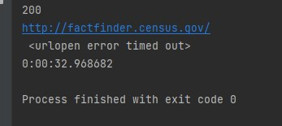

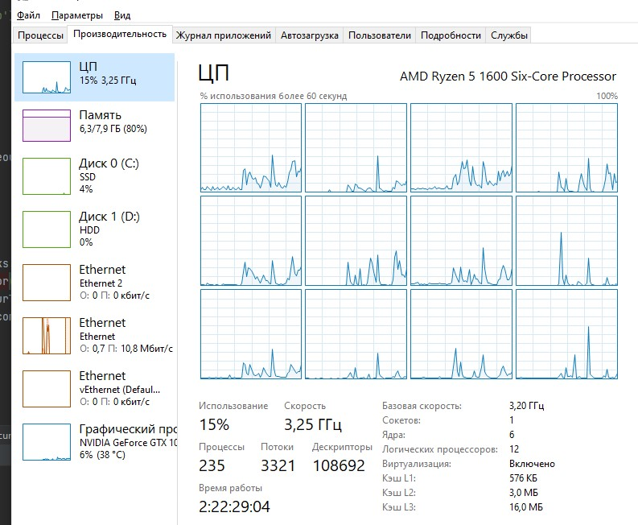

Итог: для io-bound задач увеличение количества потоков уменьшает время выполнение программы

cpu-bound

Синхронный код

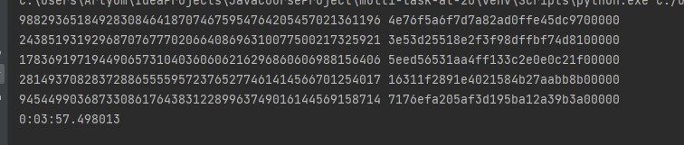

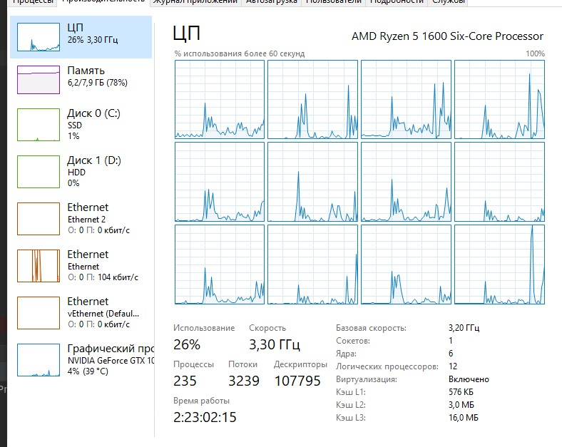

4 воркеров

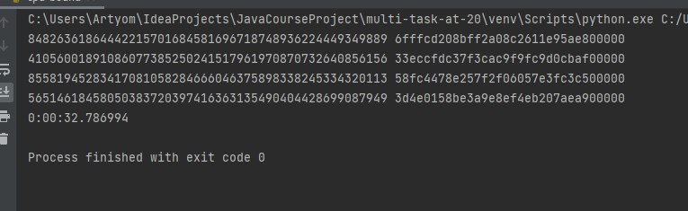

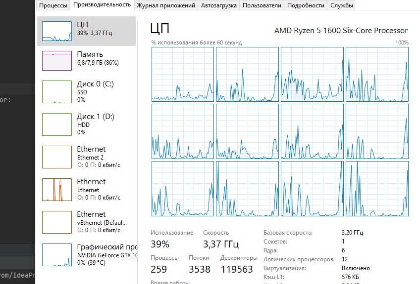

2 воркеров

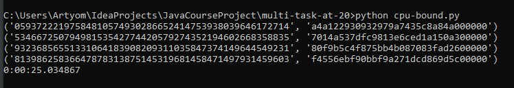

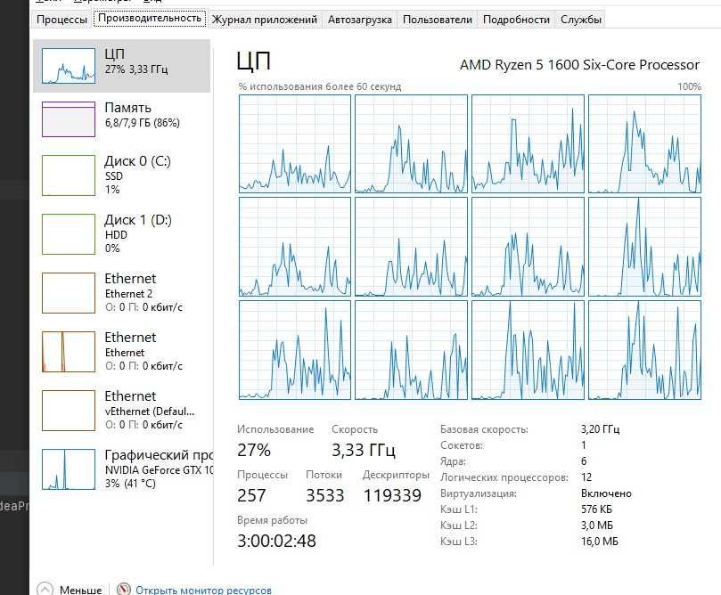

5 воркеров

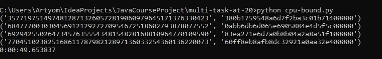

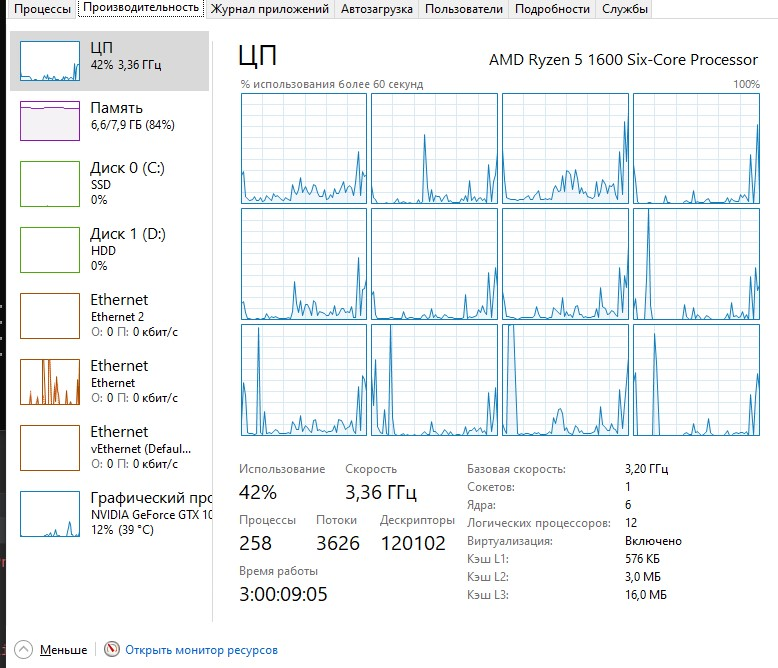

10 воркеров

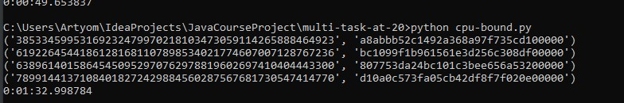

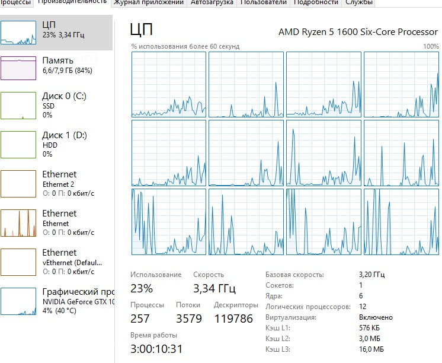

10 воркеров и 10 монет

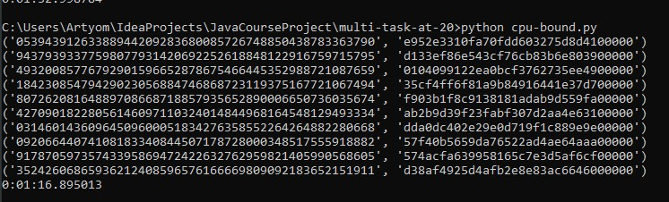

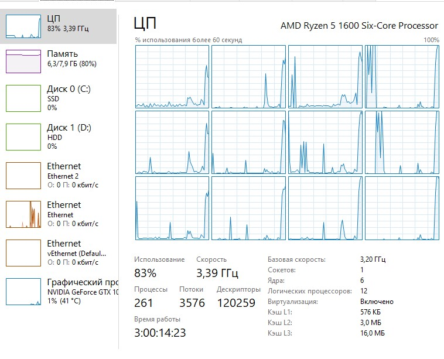

Вывод: ускорение работы получается только при увеличении количества создаваемых монет. В обратном случае наблюдается замедление

При cpu-bound задачах увеличение потоков замедляет работу программы

10 потоков и 10 монет

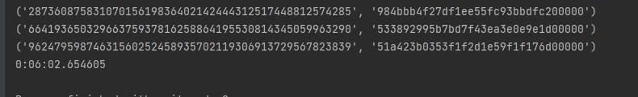

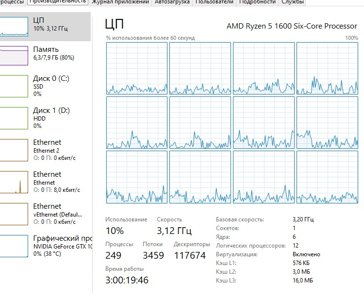